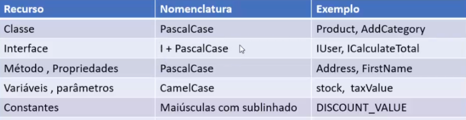

# Clean-Architecture-Essencial
Criando projetos .NET Core segundo a Clean Architecture

## Conceitos e Fundamentos
[Acesse aqui](theory.md)

## Proposito
Criação de uma aplicação ASP.NET Core 5.0 MVC e estudo dos seguintes temas:

- Separação de Conceitos
- Inversão de dependência
- Injeção de dependência
- Padrão MVC
- Padrão Repository
- Padrão CQRS
- Arquitetura Monolítica
- Arquitetura em Camadas
- Arquitetura Cebola
- Conceitos do Domain Drive Design

Vamos passar de uma solução monolitica a partir do template padrão do Visual Studio para uma solução contendo 5 projetos, respeitando a sepação de conceitos dada a modelagem feita via DDD.

## Ferramentas Utilizadas
- .NET Core SDK
- ASP.NET Core
- Visual Studio ou Visual Studio Code
- SQL Server
- SQL Server Management Studio

## Comandos Básicos

<code> dotnet new </code> - cria um novo projeto. 
<code> dotnet --version </code> - lista a versão do dotnet vinculado aquele alias. 

<code> dotnet new mvc -o mvctest </code> - cria um novo projeto do tipo MVC criando uma pasta de mesmo nome. 
<code> dotnet new mvc -o mvctest --name mvctest1 </code> - cria um novo projeto do tipo MVC criando uma pasta de nome mvctest e o nome do projeto fica mvctest1. 

<code> dotnet restore </code> - restaura pacotes do projeto. (???). 
<code> dotnet run </code> - executa o projeto. 

<code> dotnet build </code> - dá build o projeto. 
<code> dotnet publish </code> - publica o projeto. 

<code> dotnet test </code> - testa o projeto. 
<code> dotnet clean </code> - limpa o projeto(???). 

<code> dotnet sln </code> - (???). 
<code> dotnet help </code> - é bem claro. 

<code> dotnet pack </code> - empacota o projeto.(???) 
<code> dotnet migrate </code> - migra o projeto.(???) 

<code> dotnet store </code> - registra o projeto.(???) 
<code> dotnet vtest </code> - (???) 

## Comandos de modificação de projeto
<code> dotnet add package </code> - adiciona pacotes ao projeto. 
<code> dotnet add reference </code> - adiciona referencias ao projeto. (???) 

<code> dotnet remove package </code> - remove pacotes ao projeto. 
<code> dotnet remove reference </code> - remove referencias ao projeto. (???) 

## Comandos avançados
<code> nuget delete </code> - (???) 
<code> nuget locals </code> - (???) 

<code> nuget push </code> - (???) 
<code> msbuild </code> - (???) 

<code> dotnet install script </code> - (???) 

## Tipos de projetos
- MVC
- ClassLib
- Web
- Webapp
- SLN
- Mstest
- Xunit
- Webconfig
- Razor
- Console
- Angular

## Comandos para criação de Solution
<code> dotnet new sln </code> - cria a Solution usando o nome da pasta atual. 
<code> dotnet new sln -o </code> - cria a Solution usando a pasta com o nome indicado, caso não exista a pasta será criada. 

<code> dotnet new sln --name </code> - cria a Solution especificando o nome na pasta atual. 
<code> dotnet new sln -o --name </code> - cria a Solution especificando o nome na pasta com o nome indicado. 

### Gerenciar projetos na solução

<code> dotnet sln Solution1.sln add Project1.csproj </code> - adiciona o projeto 1 a solução 1. 
<code> dotnet sln Solution1.sln add path/Project1.csproj path/Project2.csproj </code> - adiciona os projetos 1 e 2 a solução 1, podendo estar em caminhos diferentes. 

<code> dotnet sln Solution1.sln remove Project1.csproj </code> - remove o projeto 1 a solução 1. 
<code> dotnet sln Solution1.sln remove path/Project1.csproj path/Project2.csproj </code> - remove os projetos 1 e 2 a solução 1, podendo estar em caminhos diferentes. 

<code> dotnet sln Solution1.sln list </code> - lista os projetos dentro da solução 1. 

---
## Definindo o projeto - Escopo Geral

Criar um projeto Web para tratar com produto se categorias que podem ser usados para criar catálogo de produtos de vendas;

- Criar uma aplicação ASP .NET Core MVC no Visual Studio Community (VS Code) que permita o gerenciamento de produtos e categorias; 
- Definir no projeto as funcionalidades para poder consultar, criar, editar e excluir (CRUD) produtos e categorias; 
- Definir o modelo de domínio usando classes e com propriedades e comportamentos: Product e Category; 
- Definir qual arquitetura a ser usada no projeto: Usar a abordagem da Clean Architecture; 
- Definir os padrões que iremos implementar no projeto: MVC, Repository e CQRS; 
- Definir os atributos para o domínio Product: 
    - Id (int, Identity)
    - Narge (string)
    - Description(string)
    - Price(decimal)
    - Stock(int)
    - Image(string)
- Definir os atributos para o dominio Category: 
    - Categoryld (int, Identity)
    - Name(string)
- Definir o relacionamento usado: teremos um relacionamento um-para-muitos entre Categoria e Produto;

### Definição das regras de negócio do Produto

- Definir a funcionalidade para exibir os produtos; 
- Definir a funcionalidade para criar um novo produto; 
- Permitir alterar as propriedades de um produto existente (O ld do produto não poderá ser alterado); 
- Definir a funcionalidade para excluir um produto existente pelo seu ld; 
- Definir o relacionamento do produto com a categoria (propriedade de navegação); 
- Não permitir a criação de um produto com estado inconsistente (criar um construtor parametrizado); 
- Não permitir que os atributos do produto sejam alterados externamente (setter privados); 
- Não permitir que os atributos ld, Stock e Price possuam valores negativos; 
- Não permitir que os atributos Name, Description sejam nulos ou vazios; 
- Permitir que o atributo Image seja null; 
- O atributo Name não poderá conter menos que 3 caracteres; 
- O atributo Description não poderá conter menos que 5 caracteres; 
- O atributo Image não poderá conter mais que 250 caracteres; 
- O atributo Image será armazenado como uma string e o seu arquivo será separado em uma pasta do projeto; 
- Definir a validaçõa das regras de negócio para o domínio Produto; 

### Definição das regras de negócio da Categoria

- Definir a funcionalidade para exibir as categorias;
- Definir a funcionalidade para criar uma nova categoria;
- Permitir alterar as propriedades de uma categoria existente (O Id da categoria não poderá ser alterado);
- Definir a funcionalidade para excluir uma categoria existente pelo seu ld;
- Definir o relacionamento entre categoria e produto (propriedade de navegação);
- Não permitir a criação de uma categoria com estado inconsistente (criar um construtor parametrizado);
- Não permitir que os atributos da categoria sejam alterados externamente (setter privados);
- Não permitir que o atributo Categoryld tenha valor negativo;
- Não permitir que o atributos Name seja null ou vazio;
- O atributo Name nāo poderá conter menos que 3 caracteres;
- Definir a validação das regras de negócio para o domínio Categoria;

### Persistência dos dados usada no projeto

- Usar banco de dados relacional: SQL Server (MySql, PostgreSql, sQLite, Oracle, etc.);
- Usar a ferramenta ORM: Entity Framework Core;
- Usar a abordagem Code-First do Entity Framework Core para criar o banco de dados e as tabelas;
- Provedor do banco de dados: Microsoft.EntityFrameworkCore.SqlServer;
- Ferramenta para aplicar o Migrations: Microsoft.EntityFrameworkCore.Tools
- Desacoplar a camada de acesso a dados do ORM: Padrão Repository;

### Nomenclatura

Usar a nomenclatura recomendada pela Microsoft para nomear classes, métodos, parâmetros e variáveis

- CamelCase: Em palavras compostas ou frases, a primeira letra da primeira palavra é iniciada com minúscula e unidas sem espaços. Ex: valorDo Desconto, nomeCompleto
- PascalCase: Em palavras compostas ou frases montadas com palavras, a primeira letra de cada
palavra é iniciada com maiúíscula. Ex: CalculalmpostoDeRenda0, ValorDoDesconto

  

### Estrutura do projeto

Criação de uma solução e 6 projetos separados em camadas com responsabilidades definidas, como a clean architecture sugere; 

O nome da soluçaão será: CleanArchMvc e os projetos são:
- CleanArchMvc.Domain: Modelo de domínio, regras de negócio, interfaces;
- CleanArchMvc.Domain.Tests: Testes unitários do dominío;
- CleanArchMvc.Application: Regras de domínio da aplicação, mapeamentos, serviços, DTOs, CQRS;
- CleanArch Mvc.Infra.Data: EF Core, Contexto, Configurações, Migrations, Repository;
CleanArchMvc.Infra.loc : Dependency Injection, registro dos serviços, tempo de vida;
-CleanArch Mvc.WebUI: MVC, Controllers, Views, Filtros, ViewModels;

Obs: O projeto CleanArchMvc.WebUl é do tipo ASP .NET Core Web App (Model-View-Controller);
Os demais projetos serão do tipo Class Library (.NET 5.0);

### Relacionamento e dependência entre os projetos

- CleanArchMvc.Domain: Não possui nenhuma dependência
- CleanArchMvc.Domain.Tests: Dependência como projeto: Domain
- CleanArchMvc.Application: Dependência como projeto: Domain
- CleanArchMvc.Infra.Data: Dependência com o projeto: Domain
- CleanArchMvc.Infra.loC: Dependência com os projetos: Domain, Application, Infra. Data
- CleanArchMvc.WebUI: Dependência com o projeto: Infra.loc

### Componentes distribuídos por camadas e responsabilidade

  

