## Conceitos e fundamentos

### Modelo Anêmico (POJO) - Definição

O modelo de domínio anêmico é um modelo de domínio onde os objetos que representam as entidades do domínio contêm pouca ou nenhuma lógica de négocios (validações, cálculos, regras de négocios, etc...).

É um modelo sem comportamentos onde temos diversas propriedades com get e set públicos definidas sem lógica alguma e onde o cliente do domínio tem controle sobre como instanciar e modificar o domínio.

Exemplo:

    public class Pedido {
        public int Id{ get; set;}
        public string Clienteld { get; set; }
        public decimal Desconto { get; set;}
        public DateTime? DataPagamento {get; set; }
        public List<ltemPedido> Itens {get; set; }
    }

    public class PedidoService {
        public void Addlitem(int ld, ItemPedido item) {
        
        //validações
        }
        
        public void DescontoPedido(int Id, decimal desconto){..}

        public void PagamentoPedido(int id) {..}
        }

> Perceba que toda a validação e comportamentos estão na classe PedidoService.

Sendo assim, podemos afirmar que:
 - Contém somente propriedades com get e set públicos.
 - Não possuem validações nem comportamentos.
 - A lógica e manipulação da classe é colocada em outra classe (serviço).
 - Não possuem gerenciamento de estado, permitindo que objetos com estado inconsistente sejam criados.
 - Permitem que outros objetos criem instâncias e modifiquem o domínio.

Problemas do Modelo Anêmico:

- O cliente precisa interpretar o objetivo e o uso da classe e a lógica é enviada para outras classes, denominadas serviços da classe de domínio;
- Violação do encapsulamento;
- Dificuldade na manutenção;
Lógica de negócios duplicada;
- Não é possível garantir que as entidades no modelo estejam em um estado consistente;
- Baixa coesão; (ou seja, as classes não tem responsabilidades bem definidas)

Enriquecendo o Modelo Anêmico:

- Usar propriedades com setters privados (e as classes como sealed (classes que não podem ser herdadas, isolando o domínio));
- Validar estado da entidade; (as entidades do dominio devem se auto-validar)
- Evitar construtores sem parâmetros; (seu objeto precisa ter dados de inicialização para manter um estado válido, logo o construtor deve receber parametros para que possam ser validados e criar um estado consistente.)
- Definir invariantes;
- Trazer as regras de comportamento dos serviços para o modelo de domínio;
- Usar os conceitos da Programação Orientada a Objetos;
- Cuidado e atenção ao usar ferramentas ORM (EF Core) (pois elas tem a carecteristica de criar apenas classes com getters e setters públicos);

Exemplo:

    public class Cliente {
        public int Id{ get; set;}
        public string Nome { get; set; }
        public string Endereco { get; set;}
    }

    // ENRIQUECENDO

    public sealed class Cliente {
            public int Id { get; private set;}
            public string Nome {get; private set; }
            public string Endereco {get; private set; }

            public Cliente(int id, string nome, string endereco) {
                Validar(id, nome, endereco);
                Id id;
                Nome = nome;
                Endereco = endereco;
            }

            public void Update (int id, string nome, string endereco) {
                Validar(id, nome, endereco);
                Nome nome;
                Endereco = endereco;
            }

            private static void Validar(int id, string nome, string endereco) {
                if (id < 0) 
                    throw new InvalidOperationException("O ID tem que ser maior que 0");

                if (string.IsNullOrEmply(nome) || string.isNullOrEmply(endereco))
                    throw new InvalidOperationException("O nome ou endereço não foi informado");

                if (nome.Length > 3) 
                    throw new ArgumentException("O nome deve ter no mínimo 3 caracteres");

                if (nome.Length > 100) 
                    throw new ArgumentException("O nome excedeu 100 caracteres");
            }
        }

> - Usamos o sealed para impossibiltar que a classe seja herdada. 
> - Os setters são todos private, para isso temos um construtor que recebe e seta esses valores assim que a classe é instanciada. 
> - Temos um método de atualização, adicionando um comportamento a essa classe. 
> - Temos também um validador dos parametros. 

### Separação de Responsabilidades

Não se deve misturar conceitos e/ou responsabilidades diferentes dentro do design ou do
código de um projeto de software.

A violação deste princípio causa código duplicado com mais de uma responsabilidade, violando também os principios SOLID da Responsabilidade Unica (SRP) e o princípio DRY:
Don't Repeat YourSelf.

Exemplos de aplicação do conceito: 
- Separar a interface do usuário (front-end) da lógica de negócios (back-end). 
- Separar o código de acesso a dados do código da apresentação dos dados. 
- Separar o projeto em diferentes módulos/camadas com responsabilidade distintas. 
- Criar componentes/classes/funções que realizam apenas uma única tarefa com eficiência. 

A aplicação da Separação dos Conceitos/Responsabilidades envolve dois processos: 
1- Reduzir o acoplamento 
2- Aumentar a coesão 

Acoplamento: 
Acoplamento é o nível de dependência/conhecimento que pode existir entre os componentes do sistema; 
Quando maior o acoplamento entre os componentes do sistema maior será dependência entre eles, e mais difícil será
manter, reusar e estender o sistema. 

Coesão: 
- Coesão é o nível de integridade interna dos componentes do sistema; 
Quanto maior a coesão entre os componentes mais definidas são suis responsabilidades sendo mais dificil desmembrar o componente em outros componentes. 

Portanto quanto menor o acomplamento e mais alta a coesão de um componente ou módulo do sistema mais fácil ele será de manter, reusar e estender.

As maiores vantagens serão: 

1- Facilita a manutenção. A não duplicação do código e as responsabilidades bem definidas dos componentes do projeto tornam o sistema mais fácil de manter. 
2- Melhor reutilização de código. O principal benefício de reutilizaro código é a redução dos custos de manutenção. Sempre que você precisar estender a funcionalidade ou corrigir
um bug - é muito menos doloroso fazer isso quando você tem certeza de que ele aparece em apenas um lugar. 
3- Melhor clareza de código. É muito mais fácil entender o que está acontecendo no programa quando cada módulo tèm uma APl concisae clara com um conjunto de métodos com escopo lógico e bem definido. 
4- Melhora a testabilidade. Módulos independentes com funcionalidade e escopo adequado e com isolamento do resto do aplicativo são fáceis de testar. Você não precisa configurar o
ambiente inteiro para ver como seu módulo funciona, basta substituir os módulos reais por simulações ou fontes de dados falsas. 
5- Permite um evolução mais rápida do projeto. Quer seja um novo recurso ou uma atualização de um recurso existente, o isolamento dos módulos ajuda a definir o escopo das
áreas do projeto que podem ser afetadas pela mudança, acelerando assim o desenvolvimento. 

### Inversão da dependência

- A direção da dependência em uma aplicação deverá ser na direção da abstração e não nos detalhes de implementação; 
- Módulos de alto nível não devem depender de módulos de baixo nivel. Ambos devem depender de uma abstração; 
- Abstrações não devem depender de detalhes. Detalhes devem depender de abstrações; 

Pensando os módulos como classes, temos que:

- Módulos de alto nível são classes da camada de negócio que encapsulam uma lógica complexa; 
- Módulos de baixo nível são classes da camada de infraestrutura que implementa operações básicas como acessoa dados, ao disco, protocolos de rede, etc.; 
- As abstrações seriam interfaces ou classes abstratas que não possuem implementação; 
- Assim as classes da camada de negócio não devem depender das classes da camada de infraestrutura mas ambas devem depender de interfaces ou classes abstratas; 

Obs: 
> Não confundir o princípio da inversão da dependência com o padrão de projeto da injeção da dependência. Injeção de dependência serve para manter um baixo acomplamento entre os componentes.

Veja o seguinte exemplo:

    class RecuperarSenha {
        private MySqlConnection conexaoBanco;

        public RecuperarSenha() {
            conexaoBanco = new MySqIConnection();
        }
            //código para recuperty senha
    }
 

    class MyqlConnection {
        public void Conectar() {
            Console.WriteLine("Conexão com MySql");
            //código...
        }
    }

>Perceba o alto acomplamento ao dar new MySqlConnection(); na classe Recuperar senha, ou seja: atribuindo uma responsabilidade que não é dela. Isso faz com que RecuperarSenha viole o principio da Inversão de Dependência onde um modulo de alto nível (RecuperarSenha) dependa da classe MySqlConnection que é uma Classe Concreta ou Implementação e pertence a um módulo de baixo nível.

Para resolver a questão, vamos aplicar a inversão da dependência.

    interface IDataBaseConnection {
        void Conectar();
    }
> Criamos uma interface definindo um contrato para quem a utiliza.

 

    class MyqlConnection: IDataBaseConnection {
        public void Conectar() {
            Console.WriteLine("Conexão com MySql");
            //código...
        }
    }
> E definimos isso no módulo de baixo nível MySqlConnection.

 

    class RecuperarSenha {
        private IDataBaseConnection conexaoBanco;

        public RecuperarSenha(IDataBaseConnection _conexao) {
            conexaoBanco = _conexao;
        }
            //código para recuperty senha
    }
> Agora, utilizamos o padrão de injeção da dependência, para injetar a dependência no construtor da classe RecuperarSenha, não mais utilizando uma instancia para criar a conexão com o banco de dados e sim usando um tipo, vinculado a abstração que criamos.

Estamos aplicando a inversão de controle ou Inversion of Control (loC) na classe RecuperarSenha e tirando a
responsabilidade dela de criar a instância da classe MySqlConnection. 
Implementamos assim a inversão da dependência usando a inversão de controle(IoC) e injeção de dependência (DI).  

Em uma arquitetura em camadas, um componente de alto nível não deve depender de um componente de baixo nível. Devemos criar uma abstração e fazer os dois componentes depender desta abstração.

#### Resumo

- Principio da inversão da dependência (DIP) - É um principio que sugere uma solução para o problema da dependência mas nāo diz como implementar ou que técnica usar; 
- Injeção da dependência(DI) - Padrão de projeto usado para implementar a inversão da dependência. Permite injetar a implementação concreta de um componente de baixo nível
em um componente de alto nível; 
- Inversão de Controle (loC) - É uma forma de aplicar a inversão da dependência permitindo que componentes de alto nível dependam de uma abstração e não de um componente de
baixo nível; 
- Contâiner loC - Contáiner de Injeção de dependência -
É um framework que permite fazer a injeção de dependência de forma automática nos componentes. (vide Angular e ASP.NET)

### Padrão Repository

#### O que e o padrão Repository? 

Definição de Martin Fowler no livro
Patterns of Enterprise Application Architecture:  
"O padrão Repository faz a mediação entre o domínio e as camadas de mapeamento de dados, agindo como uma coleção de objetos de dominio em memória..." 

Um repositório é essencialmente uma coleção de objetos de dominio em memória, e, com base nisso o padrão Repository permite desacoplar o modelo de dominio do código de acesso
a dados. 

Ao utilizar o padrão Repository você pode realizar a persistência ea separação de interesses em seu código de acesso a dados visto que ele encapsula a lógica necessária para persistir os objetos do seu domínio na sua fonte de dados.

#### Implementação e Tipos de repositório

Em uma implementação padrão podemos começar definindo uma interface que atuará como a nossa fachada de acesso aos dados e a seguir definir a implementação na classe concreta. 

Podemos implementar os seguintes tipos de repositório:
- Repositório Genérico 
- Repositório Especifico 
E podemos realizar uma implemerntação síncrona ou assincrona (Task, async/await)

#### Implementação

1- Criar uma interface ou classe abstratae definir o contrato com os métodos do repositório; 
2- Criar a classe concreta que implementa a interface; 

#### Respositório Genérico

    IRepository<T>
    Add()
    Remove()
    Get()
    GetId(int id)
> Geralmente criado no módulo Domain ou Application

    Repository<T>
    ...
    ...
    ...
    ...
> Geralmente criado no módulo Infrastructure

 

#### Respositório Especifico

    IProductRepository
    Add()
    Remove()
    Get()
    GetId(int id)
> Geralmente criado no módulo Domain ou Application

    ProductRepository
    ...
    ...
    ...
    ...
> Geralmente criado no módulo Infrastructure

 

#### Exemplo - Respositório Genérico

    public interface IRepository<T> : where T class {
        IEnumerable<T> GetAll ();
        T GetByID(int id);
        void Add(T item);
        void Update(T item);
        void Delete(T item);
    }
> Criamos a interface

 

    public class Repository<T>: IRepository<T> where T: class {
        ... //Implementação
    }
> Implementamos a interface na Clase Repository Genérica

 

    public class CustomerController: Controller {
        private readonly IRepository<Customer> _repo;

        public CustomerController(IRepository<Customer> repo) {
            _repo = repo;
        }
    }
> Fazemos a injeção de dependencia no construtor do controler passando o tipo Customer para o Repositório Genérico

 

#### Exemplo - Respositório Específico

    public interface ICustomerRepository {
        IEnumerable<T> GetAll ();
        T GetByID(int id);
        void Add(T item);
        void Update(T item);
        void Delete(T item);
    }
> Criamos a interface

 

    public class CustomerRepository: ICustomerRepository {
        ... //Implementação
    }
> Implementamos a interface na Classe Repository Específica

 

    public class CustomerController: Controller {
        private readonly ICustomerRepository _repo;

        public CustomerController(ICustomerRepository repo) {
            _repo = repo;
        }
    }
> Fazemos a injeção de dependencia no construtor do controler

 

### E qual utilizar - Genérico ou Específico ?

- Um repositório genérico pode ser usado por qualquer entidade da camada de negócios e com isso economizamos código.
- Ocorre que cada entidade da camada de domínio pode possuir suas particularidades distintas de outras entidades e isso pode inviabilizar o uso de um repositório genérico.
- Assim para decidir é precisa fazer uma análise prévia do modelo de domínio e das particularidades de cada entidade.

### Benefícios

- Minimiza a lógica de consultas na sua aplicação evitando consultas esparramadas pelo seu código;
- Encapsula a lógica das consultas em um repositório;
- Desacopla a sua aplicação dos frameworks de persistência como o Entity Framework Core;
- Facilita a realização de testes de unidade em sua aplicação (repositório fake) Centraliza a lógica de acesso a dados facilitando a manutenção;

 

## Padrão MVC

O padrão MVC fornece uma maneira de separar a funcionalidades e responsabilidades envolvidas com a manutenção e apresentação dos dados de uma aplicação usando 3 componentes:

- O Model- Representa os dados a serem tratados e não inclui detalhes de implementação; 
- A View Representa o componente de interface com o usuário(UI) e esta vinculado ao Model; 
- O Controller - Fornece um mecanismo para o usuário interagir com o sistema definindo como a interface do usuário vai reagir a ação do usuário. E responsável por trocar e interpretar mensagens entre a View eo Model; 

### Padrões de comunicação

Permitidos 
- Os usuários podem interagir com uma View;
- Views podem interagir com Controllers;
- Controllers podem interagir com Views;
- Controllers podem se comunicar com outros Controllers;
- Controllers podem se comunicar com o Model;

Não Permitidos 
- Os usuários não podem interagir diretamente com o Model;
- Views não podem interagir diretamente com outras Views;
- Views não podem interagir diretamente como Model;
- Models não podem interagir com outros Models;

### Benefícios

- A View e o Model são desacoplados ou dissociados. Isso significa que você pode ter muitas Views associadas com
um determinado model;

- A dissociação View-Controller permite que você altere a forma como uma aplicação responde à entrada do
usuário sem alterar o modo de exibição, permitindo que a interface do usuário (a view) seja alterada sem
alterar a maneira como o aplicativo responde à entrada do usuário;

- A separação das responsabilidades permite que diferentes membros da equipe possam se concentrar em uma
parte da aplicação que melhor se alinha com suas respectivas habilidades.;

- Como o padrão MVC gerencia múltiplos visualizadores usando o mesmo modelo, é fácil manter, testar e atualizar
mais de um sistema;

### Padrão MVC x Arquitetura em 3 Camadas (MVC não é 3 camadas)

O padrão MVC está relacionado com a arquitetura da aplicação e em como os componentes se comunicam.

A arquitetura em 3 camadas esta relacionada com a arquitetura do sistema onde você divide as responsabilidades em camada de apresentação, de negócio e de acesso aos dados.

  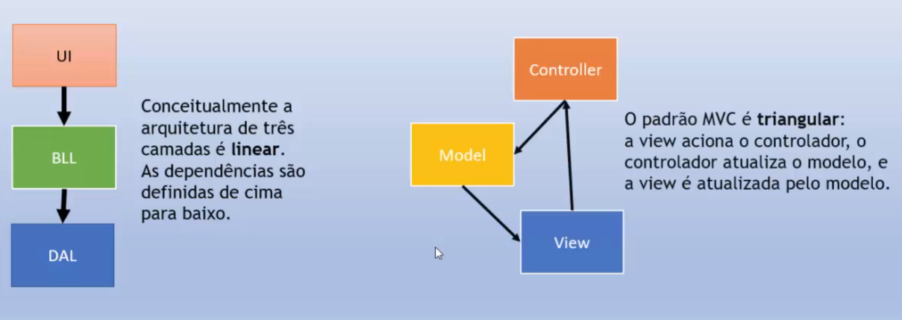

Os conceitos se complementam e podem coexistir harmonicamente sem conflitos. Você pode usar o padrão MVC para a camada de apresentação de uma arquitetura em camadas.

### Implementação do padrão MVC em uma arquitetura de 3 camadas

  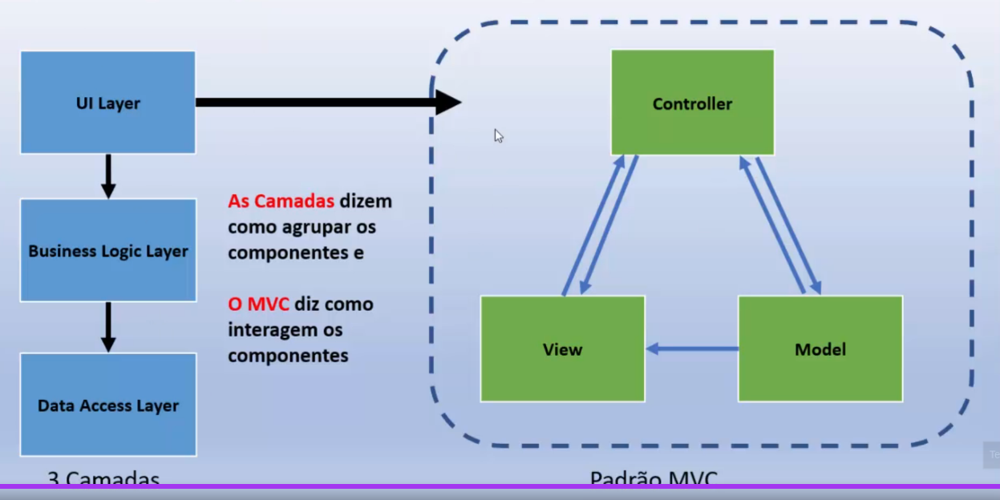

 

### Padrão CQRS

O acrônimo CQRS significa Command Query Responsibility Segregation ou, numa tradução livre, Segregação de Responsabilidade de Consulta e de Comando, e é utilizado para aplicar modelos diferentes para operações de leitura e gravação.

Vejamos os seguintes cenários:

#### Cenário Clássico
Neste cenário temos um banco de dados apenas, e os comandos (tudo que altera o estado de uma entidade - insert, update, delete...) e as queries (não altera o estado de uma entidade - select).

#### Cenário com CQRS

Neste cenário temos um banco de dados ou mais de um, dependendo da modelagem para separar comandos de queries, sendo assim, separando meios de escrita e de leitura.

  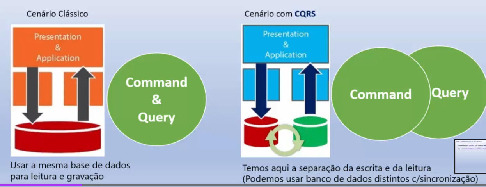

O CQRS é um padrão de projeto arquitetural para separar os processos de leitura e gravação da sua aplicação. As alterações de dados são realizados via Commands e a leitura de dados são realizados via Queries.

- Commands representa tudo o que altera o estado de uma entidade (insert, update, delete);
- Queries não alteram estado da entidade (select);

A utilização do CQRS é indicada para um cenário onde existe uma alta demanda de consumo de dados com operações de leitura e escrita feitas de forma bem intensa.

#### Funcionamento

O CQRS separa leituras e gravações em modelos diferentes,
usando comandos para atualizar dados e consultas para ler
dados.
- Os comandos devem ser baseados em tarefas, e nāo centrados
em dados;
- Os comandos podem ser colocados em uma fila para
processamento assíncrono, em vez de serem processados de
forma síncrona;
- As consultas nunca modificam o banco de dados. Uma
consulta retorna um DTO que não encapsula nenhum
conhecimento de domínio;

Para obter um maior isolamento, você pode separar fisicamente os dados de leitura dos dados de gravação. Nesse caso, o banco de dados de leitura pode usar seu próprio esquema de dados otimizado para consultas.

  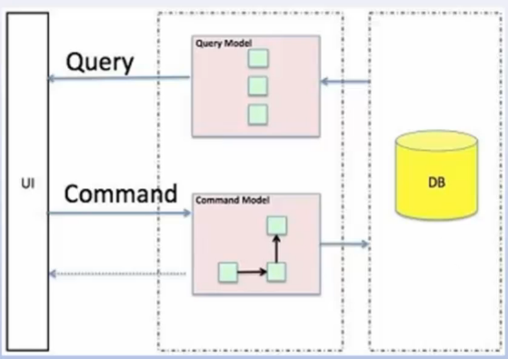

#### Pensando o projeto em camadas... 

Na abordagem tradicional tanto os comandos como as consultas seguemo mesmo caminho dentro da arquitetura definida percorrendo assim todas as
camadas, como vemos abaixo: 

  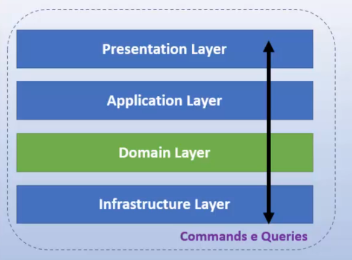

 

Ja a ideia do CORS é definir responsabilidades diferentes para comandos e para consultas. 
Onde as consultas não necessitam passar por todas as
camadas seguindo o mesmo caminho dos comandos. 
Com isso podemos otimizar as consultas que são o grosso do
processamento, e, também os comandos. 
Veja abaixo:

  

#### Benefícios

- Escala independente. O CQRS permite que as cargas de trabalho de leitura e gravação sejam escalonadas independentemente oque pode resultar em menos contenções de bloqueio; 
- Esquemas de dados otimizados. O lado de leitura pode usar um esquema otimizado para, consultas, enquanto o lado de gravação usa um esquema otimizado para atualizações; 
- Segurança. E mais fácil garantir que apenas as entidades de domínio corretas estejam executando gravações nos dados; 
- Separação de responsabilidades. A segregação dos dados de leitura e gravação pode resultar em modelos mais flexíveis e fáceis de manter. A maior parte da lógica de negócios complexa entra no modelo de gravação.
O modelo de leitura pode ser relativamente simples; 
- Consultas mais simples. Ao armazenar uma visualização no banco de dados de leitura, o aplicativo pode evitar junções(joins) complexas durante a consulta tornando as consultas mais simples;

#### Implementação na ASP .NET Core

- Usa a biblioteca MediatR (usa o padrão Mediator)
- E o pacote MediatR.Extensions.Microsoft.Dependencylnjection

A utilização do CQRS não é recomendada quando:
- O domínio ou as regras de negócios forem bem simples;
- Uma interface de usuário simples no estilo CRUD e operações de acesso a dados forem suficientes
para resolver o problema;

### Arquitetura Monolítica

A Arquitetura Monolítica é um sistema único, nāo dividido, que roda em um único processo, ou seja, é uma aplicação na qual diferentes componentes estão ligados a um único programa dentro de uma única plataforma.

Na arquitetura monolítica o núcleo do comportamento da aplicação é executado em seu próprio processo e a aplicação inteira é implantada como uma única unidade.

Um aplicativo criado com essa arquitetura pode escalar verticalmente aumentando o poder das máquinas em que a aplicação roda ou horizontalmente com a adição instâncias atrás de um Load Balancer.

#### Vantagens e Desvantagens

Vantagens 
- Mais simples de desenvolver: A organização fica concentrada em um único sistema e muitos desenvolvedores estão familiarizados com este modelo sendo que o desenvolvimento inicial é mais rápido; 
- Simples de fazer o deploy para o servidor: Fazemos o deploy de um único pacote final; 
- Exige uma equipe menor Necessita de um time menor para desenvolver e manter a aplicação; 
 

Desvantagens
- Manutenção: a aplicação se torna cada vez maior de acordo com o seu tamanho, o código será cada vez mais dificil de entender eo desafio de fazer alterações rápidas e ter que subir para o servidor só cresce; 
- Alterações: para cada alteração feita, é necessário realizar um novo deploy de toda a aplicação; 
- Fragilidade: uma linha de código que subiu errada pode quebrar todo o sistema e ele ficar totalmente inoperante; 

#### Exemplo: Aplicação ASP.NET Core MVC

A Separação de conceitos é obtida por meio da criação de pastas no projeto

  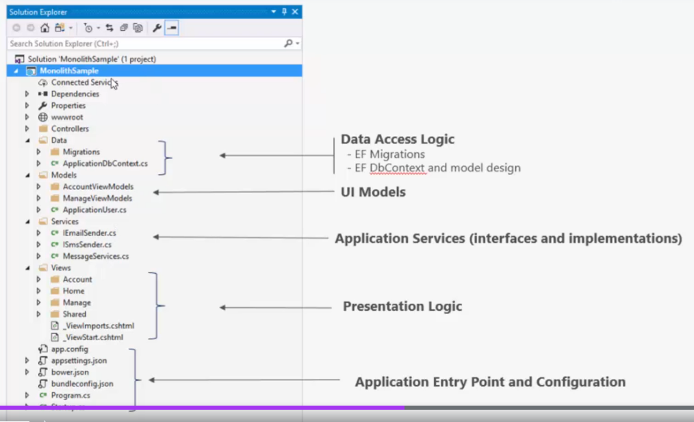

> Desvantagens: O numero de pastas tende a crescer e as pastas não estão agrupadas em ordem;
 

> A lógica de negócio esta espalhada entre as pastas Models e Services;
 

>Não existe uma indicação clara das dependências entre as classes nas pastas;
 

> Falta de organização leva ao código espaguete (forte acomplamento, baixa coesão e as responsabilidades não estão bem definidas.);

#### Evolução da Arquitetura Monolítica
- As aplicações que usam a arquitetura monolítica podem ser beneficiar usando a separação lógica de responsabilidades em camadas; 
- Para isso as aplicações evoluem para soluçöes com vários projetos onde cada projeto reside em uma camada com responsabilidade especifica; 
Podemos ter uma evolução de um arquitetura monolítica de projeto único para uma arquitetura monolítica em camadas também conhecida como arquitetura em camadas; 

### Arquitetura em Camadas
 
A arquitetura em camadas visa a criação de aplicativos modulares, de forma que cada camada possui uma responsabilidade e onde a camada superior se comunica com a camada inferior e assim por diante, fazendo com que uma camada seja dependente apenas da camada imediatamente inferior.

Podemos assim dividir um sistema em uma, duas, três ou n camadas dependendo do objetivo e da complexidade do sistema .

Dependendo do contexto as camadas podem ser lógicas (Layers) ou físicas (Tiers).

Uma das mais conhecidas é a arquitetura em três camadas, onde temos as camadas de interface(U), a camada da lógica dos negócios(BLL) e a camada de acesso aos dados(DAL).

  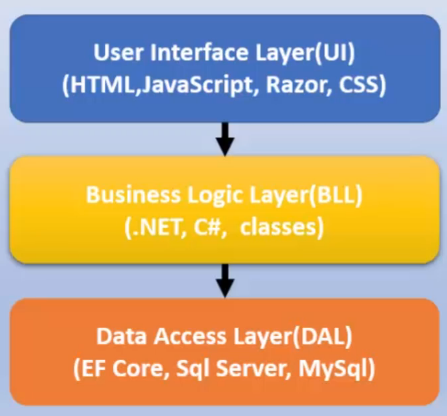

Aqui temos a dependência entre as camadas
definida de çima para baixo. 
A camada Ul depende da camada BLL e esta depende da camada DAL. 
A comunicação deve passar pela camada de negócios (BLL).

#### Arquitetura em Camadas: Exemplo
 

  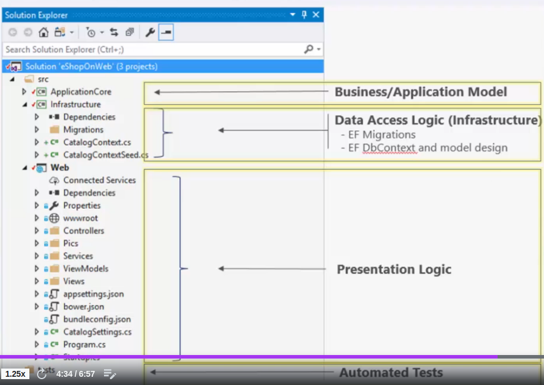

- Os usuários interagem com a camada de UI; 
- A camada de Ul interage apenas com a camada de negócios (BLL); 
- A camada de negócios pode chamar a camada de acesso a dados (DAL); 
- A camada de Ul não deve interagir com a DAL diretamente; 
- A implantação é feita como uma unidade única pois ainda estamos na arquitetura monolítica; 

#### Vantagens

- Com a organização do código em camadas podemos reutilizar a funcionalidade de baixo nível em todo o aplicativo; 
- Com uma arquitetura em camadas, os aplicativos podem impor restrições sobre quais camadas podem se comunicar com outras camadas; 
- Essa arquitetura ajuda a atingir o encapsulamento; 
- Quando uma camada é alterada ou substituída, apenas as camadas que interagem com ela serão afetadas; 
- As camadas (e o encapsulamento) tornam muito mais fácil substituir a funcionalidade dentro do projeto; 

#### Desvantagens

- As dependëncias em tempo de compilação são executadas de cima para baixo
Assim a camada de negócios (BLL) depende dos detalhes de implementação da camada de acesso aos dados; 
- Testar a lógica de negócio nesta arquitetura é difícil pois exige um banco de dados de teste; 

Para resolver esse problema podemos usar a inversão da dependência em uma arquitetura mais robusta como a Arquitetura Cebola (Onion Architecture)

 

### Arquitetura Cebola

A arquitetura de cebola esta baseada no principio da inversao de controle e e composta por varias camadas concêntricas que se interconectam em direção ao núcleo que representa o dominio. Ela não depende da camada
de dados como nas arquiteturas em várias camadas, mas dos modelos de dominio reais.

  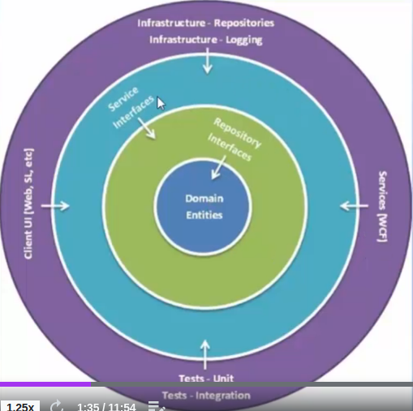

A Onion Architecture resolveu o problema do acoplamento
entre as camadas definindo camadas a partir do núcleo para
a infraestrutura.

Ela Aplica a regra fundamental movendo todos os
acoplamentos em direção ao centro, sendo que no centro da
Onion Architecture está o modelo de dominio, que representa
os objetos de negócios e o comportamento.

Ao redor da camada de domínio existem outras camadas (UI,
Infra, repositórios, interfaces) com mais comportamentos.

#### Evolução

 

  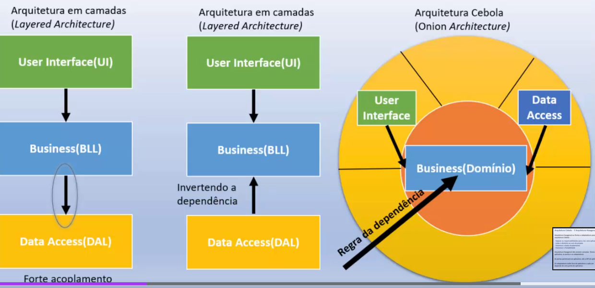

-  Na arquitetura em camadas, o fluxo de dependencia de uma camada para outra, de cima para baixo. A UI depende da BLL e a BLL por sua vez depende da DAL.
- Através da inversão de dependência, da inversão de controle e da injeção de dependência jogamos a responsabilidade da dependencia da DAL para a BLL.
- Agora, evoluimos para a arquitetura cebola, onde o dominio (BLL) não tem nenhuma dependencia e a UI e o DAL servem a esse dominio, como serviços e que podem ser substituidos facilmente.

#### Camadas

 

  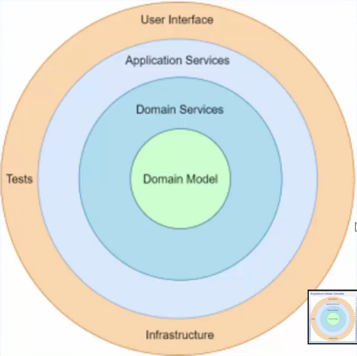

- A camada de domínio (Domain Model)- Representa os objetos
de negócios e o comportamento, e, pode conter interfaces de
domínio. Esta camada não possui nenhuma dependência; 
- Camada de serviços do Domínio (Domain Services)- cria uma
abstração entre as entidades do dominio e a lógica de negócios
do aplicativo. Nesta camada, temos as interfaces que fornecem
o comportamento de salvar e recuperar objetos, geralmente
envolvendo um repositório que acessa a fonte de dados.; 
- Camada de serviços da Aplicação (Application Services)- A
camada de serviços da aplicação mantém interfaces com
operações comuns, como Adicionar, Salvar, Editar e Excluir.
Além disso, essa camada é usada para se comunicar com a
camada da interface do usuário e a camada do repositório.
- Camada externas (U1, Infrastructure, tests) - No anel mais
externo temos os componentes que mudam com frequência: A
camada de apresentação, o acesso aos dados, e os testes.; 

#### Exemplo de projeto

 

  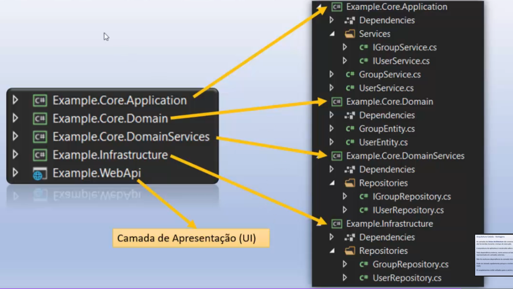

- O Domain Model está representado no projeto Core.Domain;
- O Domain Services está representado no projeto Core.DomainServices;
- O Application Services está representado no projeto Core.Application;
- O Infrascructure está representado no projeto Infrastructure;
- A User Interface está representada no projeto WebApi;

#### Vantagens

- As camadas da Onion Architecture são conectadas através de interfaces. As implementações são fornecidas durante o tempo de execução; 
- A arquitetura do aplicativo é construída sobre um modelo de dominio;
Toda dependência externa, como acesso ao banco de dados e chamadas de serviço, é representada em camadas externas; 
- Não há nenhuma dependência da camada Interna com camadas externas; 
- Pode ser testada rapidamente porque o núcleo do aplicativo, o domínio, não depende de nada; 
- Os acoplamentos estão voltados para o centro (regra de dependência); 

#### Desvantagens

- Não é fácil de entender para iniciantes; 
- Tem uma curva de aprendizado; 
- Pode ser dificil fazer a divisão das responsabilidade entre as camadas; 
- Utiliza Interfaces em profusão; 

#### Principais características

- O aplicativo é construído em torno de um modelo de objeto independente/o domínio); 
- Camadas internas definem interfaces. As camadas externas implementam interfaces.; 
- A direção do acoplamento é em direção ao centro. (Regra da dependência); 
- Todo o código principal do aplicativo pode ser compilado e executado separadamente da infraestrutura; 

#### E a Arquitetura Hexagonal?

Arquitetura hexagonal ou Portas e adaptadores possui os mesmos objetivos e principios da arquitetura Cebola:

- Separar as responsabilidades para criar uma aplicação Modular;
- Isolar o domínio no core do projeto;
- Favorecer o baixo Acoplamento;
- Favorecer a Testabilidade;

Arquitetura hexagonal não existem camadas. Temos o
aplicativo, as portas e os adaptadores.

As portas pertencem ao aplicativo, são a API do aplicativo.

Os adaptadores estão fora do aplicativo e cada um
depende de uma porta do aplicativo.

Como vamos abordar aqui a Arquitetura Cebola, vamos englobar também a Arquitetura Hexagonal, que muda apenas a forma de implementação mas não os objetivos.

### DDD - Domain Drive Design

O DDD (Domain Driven Design) é uma abordagem ao design de
software que se baseia no conceito de dominio; é uma filosofia
voltada ao dominio do negócio.

A principal ideia do DDD é a de que o mais importante em um
software não é o seu código, nem sua arquitetura, nem a
tecnologia sobre a qual foi desenvolvido, mas sim o problema
que o mesmo se propõe a resolver, ou em outras palavras, a
regra de negócio.

#### Quando usar?

O DDD não vai te ajudar a gerenciar melhor os dados, não vai te ajudar a aumentar o desempenho da sua aplicação, não vai te ajudar na complexidade da tecnologia usada no seu projeto.

O DDD vai te ajudara resolver problemas na complexidade do negócio.
A abordagem Domain Driven Design será útil em projetos onde a
complexidade da lógica de negócio justificar a sua adoção.

#### Principais conceitos usados

Ubiquitous Language (Linguagem Onipresente) 
A ubiquitous language é uma linguagem estruturada em torno do modelo
de dominio e usada por todos os membros da equipe para conectar todas
as atividades da equipe ao software.

Model 
O modelo de um projeto orientado a domínio é a sua solução para o
problema. O Model geralmente representa um áspecto da realidade ou
algo de interesse do negócio: o lanche, o cliente, a entrega, o produto, a
venda, etc.

Bounded Context 
Um Bounded Context é um limite conceitual no qual um modelo de domínio
é aplicável, sendo que ele fornece um contexto para a linguagem ubiqua que
é falada pela equipe e é expressa no modelo de software projetado.

Context Maps 
Os Context Maps ou Mapas de Contextos permitem identificar o
relacionamento entre os Bounded Contexts e as equipes responsáveis por
cada contexto.

Strategic Design (Modelagem Estratética) 
O objetivo principal da modelagem estratégica é definir 3 conceitos
importantes com a equipe de projeto: 
1. Ubiquitous Language
2. Bounded Context
3. Context Maps

Tatical Design (Modelagem Tática) 
A modelagem tática esta relacionada com os blocos de construção da DDD
podendo ser: 

- Entities
- Services 
- Repositories
- Value Objects 
- Agreggates 
- Events
- Factories
- Modules

Sendo um conjunto de recursos técnicos usados na construção do Modelo de
dominio do negócio.

Archicteture Design 
Refere-se aos estilos de arquitetura usado na implementação do DDD como:
Hexagonal, Onion, Layered, cQRS, REST, etc.

Uma das grandes vantagens do DDD é que ele não requer o uso de nenhuma
arquitetura específica.

#### Principais benefícios

- Facilita a comunicação entre as equipes com o uso da linguagem onipresente; 
- O código do projeto fica mais coeso e menos acoplado; 
- O negócio é melhor compreendido por todos da equipe o que facilita o
desenvolvimento; 
- Melhora a flexibilidade do projeto devido ao domínio ser baseado no design
orientado a objetos estando bem encapsulado e modularizado; 
- Enfatiza o dominio sobre a interface onde o foco no dominio significa produzir um produto que ressoa bem como público associado a esse domínio; 

#### Principais desvantagens

- Possui uma alta complexidade exigindo experiência, conhecimento e capacidade de interação com os especialistas do negócios; 
- Requer um conhecimento robusto do dominio; 
- Não adequado para projetos com uma alta complexidade técnica nem para projetos simples como um CRUD básico;

 

### Clean Architecture

#### O que é Arquitetura de Software?

A arquitetura de software define o que é o sistema em termos de componentes de software, os relacionamentos entre estes componentes e os padrões que guiam a sua composição e restrições.

Assim, a arquitetura significa o design geral do projeto.

E a organização do código em classes, arquivos, componentes ou módulos.

E é como todos esses grupos de código se relacionam entre si.

A arquitetura de software expõe a estrutura de um sistema enquanto oculta os detalhes de implementação.

 

#### E o que é Clean Architecture

Arquitetura limpa é um conceito proposto por Robert C. Martin (Uncle Bob) em seu livro Clean Architecture como uma forma de construir soluções de software altamente flexíveis e sustentáveis.
O conceito foi baseado nas boas práticas e nas arquiteturas hexagonal e cebola, dentre outras, que já propunham a separação das responsabilidades em camadas e tinham como objetivo produzir sistemas com as seguintes características:  

- Independente de frameworks;
- Testáveis;
- Independentes da interface do usuário;
- Independentes do banco de dados;
- Independente de qualquer agente externo;

 

  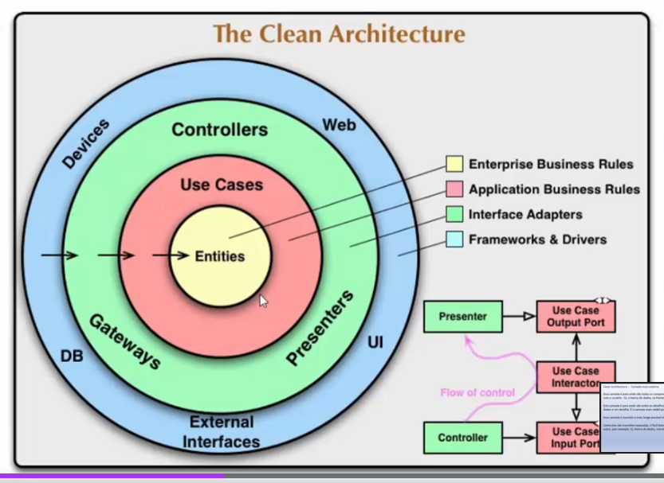

>Arquitetura limpa refere-se à organização do projeto de forma que ele seja fácil de emtender, fácil de testar, fácil de manter e fácil de mudar conforme o projeto cresce. O que faz tudo isso permanecer coeso é a Regra de Dependência, onde afirma que a dependência do código-fonte só pode apontar para o interior do aplicativo.

 

#### Entidades

- No centro da arquitetura, temos as classes responsáveis pelas regras de negócio, que podem ser de dois tipos: Entidades e Casos de Uso. 
- Uma entidade é um conjunto de regras de negócios relacionadas que são críticas para o funcionamento do aplicativo. 
- As regras seriam agrupadas como métodos em uma classe. 
- As regras existem mesmo se não existir a aplicação. 
- Como as entidades não conhecem as outras camadas elas não dependem de nada. 

#### Casos de uso

Contém as regras de negócio específicas do aplicativo.
Dizem como automatizar o sistema determinando o seu comportamento.
- Orquestram o fluxo de dados de e para as entidades
- Direcionam as entidades a usar suas regras de negócios

Exemplo:
- Obter informações de um produto: nome, preço, quantidade, etc.
- Montar catálogo de produtos;
- Validar nome, preço, estoque;
- Verificar estoque;
- Se houver estoque incluir o produto no catálogo;

Os casos de uso interagem e dependem das entidades, mas não sabem nada sobre as camadas mais distantes.

#### Adaptadores

- Na terceira camada, a partir do centro, temos classes e interfaces chamadas de Adaptadores. 
- A função delas é converter dados de um formato para outro. 
- São os tradutores entre o domínio e a infraestrutura. 
- Convertem os dados do formato mais conveniente para os casos de uso e entidades. 
- E essa camada que vai conter a implementação MVC de uma UI com apresentadores, visualizações e controladores, ou, que poderá realizara implementação dos endpoints de uma API REST. (Recebe as requisições e encaminha para os Casos de Uso). 
- Nenhum código dentro desse circulo deve saber absolutamente nada sobre o banco de dados. 

#### Camada mais externa

- Essa camada é para onde vão todos os componentes de entrada e saída ou 1/0, a interface com o usuário - IU, o banco de dados, os frameworks, os dispositivos, etc.
- Esta camada é para onde vão todos os detalhes. A interface é um detalhe. O banco de dados é um detalhe. É a camada mais volátil pois pode mudar com frequência.
- Essa camada é mantida o mais longe possível das camadas de domínio.
- Como elas são mantidos separadas, éfácil fazer alterações ou trocar um componente por outro. (por exemplo, ui, banco de dados, estruturas, dispositivos).

### Testes unitários - xUnit

Objetivo: Testar pequenas partes do software como métodos, funções, ou qualquer classe que trate com uma funcionalidade da aplicação.

É uma responsabilidade do desenvolvedor.

Vantagens realizar os testes de unidade:
- Revelam se o software esta funcionando conforme o esperado;
- Ajudam a capturar erros/problemas e corrigi-los antes de implantar o software em produção;
- Ajudam a entender os requisitos do software e se eles foram implementados;
- Ajudam os desenvolvedores a entender a funcionalidade real do software;
Ajudam a reduzir o número de erros(bugs) no início do desenvolvimento;

 

#### Dicas para escrever testes unitários:

- Não escrever casos de testes de unidades no mesmo projeto, criar um projeto separado; 
- Escrever casos de testes apenas para uma pequena unidade; 
- Não escrever casos de testes que dependam de outros casos de teste; 
- Os casos de testes de unidade devem ser bem organizados, ser sustentáveis e isolados; 
- Os casos de testes devem ser sempre independentes de recursos externos; 

#### Testes na plataforma .NET

Temos 3 bibliotecas disponíveis:

1. MSTest - É o mais antigo e simples e esta; Usa os atributos [TestClass] e [TestMethod]. 
2. NUnit - É muito popular e tem uma implementação semelhante ao MSTest.
3. xUnit -  Nasceu a partir do NUnit e por isso apresenta muitas semelhanças a este, sendo o mais recente (Foi criado pelo mesmo autor do NUnit).

Vamos utilizar o xUnit.

 

#### xUnit: [Fact] e [Theory]

Os métodos de teste sem parâmetros são decorados com o atributo [Fact]

    [Fact]
    public void Somar_dois_valores_resultado_correto() {
        ***
    }

 

Os métodos de teste com parâmetros são decorados com o atributo [Theory]

    [Theory]
    [InlineData(-10)]
    public void Nao_Pode_Criar_Valor_Negativo(decimal valor){
        ***
    }
Os valores são fornecidos aos parâmetros pelo atributo [InlineData]

 

#### xUnit: [Fact] e [Theory]

Podemos desativar um teste usando a propriedade Skip e indicar o motivo

    [Fact (Skip = "Teste ainda não disponível") ]
    public void Teste(){}

Podemos organizar os testes em grupos com o atributo [Trait] e criar nomes de categorias

    [Fact (DisplayName = "Teste Numero 2")]
    [Trait("Calculo", "Somar") 1
    public void Somar_DoisNumeros RetornaNumero(){}

 

#### Escrevendo os testes: Principio AAA - Arrange, Act e Assert (Organizar, Agir e Assertir)

 

Arrange - E onde preparamos tudo para o teste; onde preparamos a cena para testar (criar os objetos e configurá-los conforme necessário); 
Act - E onde o método que estamos testando será executado; 
Assert - E a parte final do teste em que comparamos o que esperamos que aconteça com o resultado real da execução do método de teste;

 

#### AAA - Exemplo

    [Fact]
    public void Somar_dois_valores_resultado_correto() {

        // ARRANGE
        ***
        // ACT
        ***
        /// ASSERT
        ***
    }

#### Definindo o nome dos métodos de testes de unidade

Os nomes dos métodos de teste devem ser tão descritivos quanto possível.

Usar um nome descritivo de forma a facilitar o entendimento do propósito do método a ser executado.

Exemplo de convenção de nomenclatura:

1, A primeira parte do nome representa o nome do método que está sendo testado; 
2. A segunda parte do nome nos informa mais sobre o cenário de teste; 
3. A última parte do nome é o resultado esperado; 

Exemplo: Soma_DoisNumerosInteiros_RetornaNumerolnteiro;
